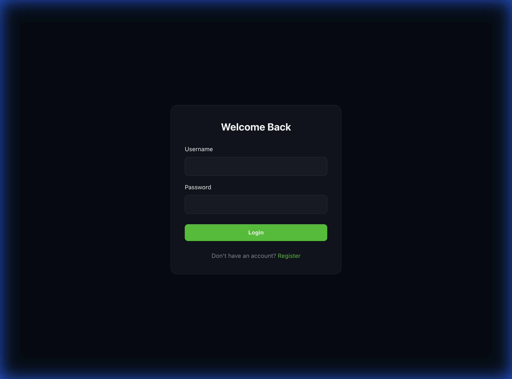
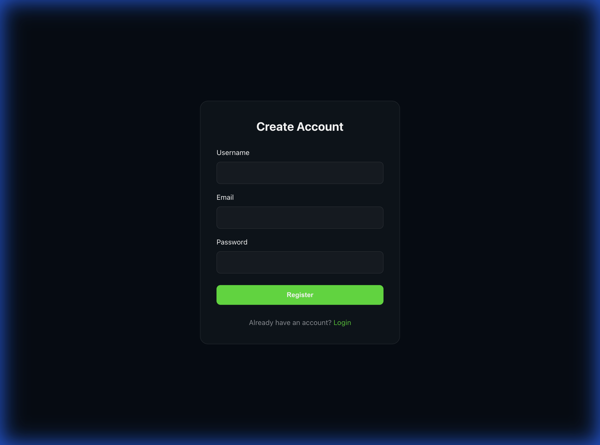
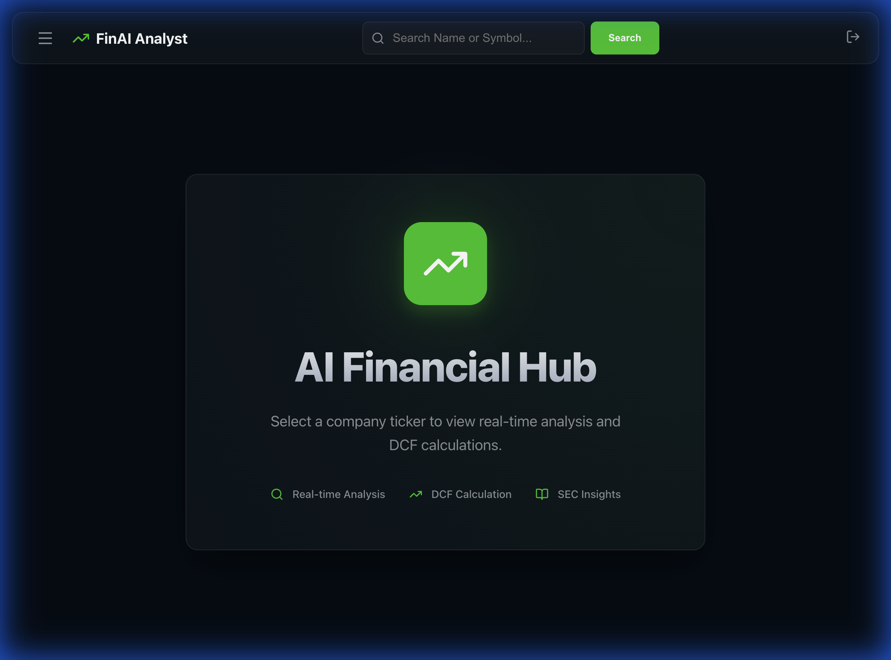
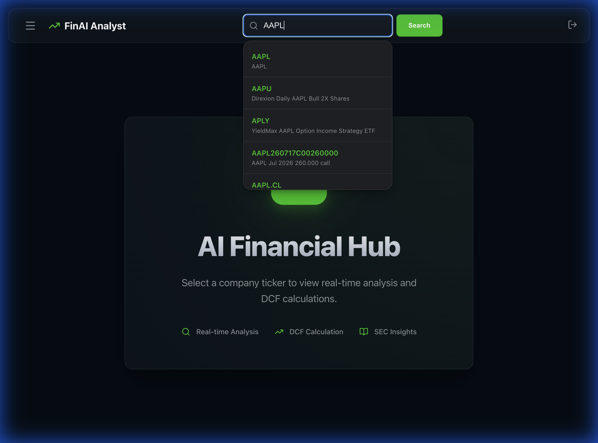

# Financial AI Project Documentation

## 1. Project Overview
Financial AI is a comprehensive web application designed to assist users with financial investment analysis. It combines a robust Django backend for handling financial data (SEC filings, stock prices) with a modern React frontend for an intuitive user experience.

Key features include:
- **User Authentication**: Secure login and registration.
- **Dashboard**: Centralized hub for market insights.
- **Stock Search**: Real-time stock searching with suggestions.
- **Financial Data Integration**: Access to SEC filings and market data via YFinance.

## 2. Technology Stack

### Backend
- **Framework**: Django & Django REST Framework
- **Data Sources**: 
    - `yfinance` for market data
    - `sec-edgar-downloader` for SEC filings
- **Language**: Python 3.12+
- **Dependency Management**: `uv`

### Frontend
- **Framework**: React (Vite)
- **Language**: TypeScript
- **Styling**: CSS / Tailwind (if applicable)
- **Icons**: Lucide React
- **Math Rendering**: Katex

## 3. Application Walkthrough & Screenshots

### 3.1. Authentication
The application requires users to store their preferences and analysis history.

**Login Page**
Users can log in with their credentials.


**Register Page**
New users can sign up for an account.


### 3.2. Dashboard
Upon logging in, users are greeted by the Dashboard, which provides an overview of the market and access to analytical tools.


### 3.3. Stock Search
The search functionality allows users to find specific stocks (e.g., AAPL). It provides real-time suggestions as you type.


## 4. Setup Instructions

### Prerequisites
- Python 3.12+
- Node.js & npm

### Backend Setup
1. Navigate to the backend directory:
   ```bash
   cd backend
   ```
2. Install dependencies (using uv or pip):
   ```bash
   uv sync
   # OR
   pip install -r requirements.txt
   ```
3. Run migrations:
   ```bash
   python manage.py migrate
   ```
4. Start the server:
   ```bash
   python manage.py runserver
   ```

### Frontend Setup
1. Navigate to the frontend directory:
   ```bash
   cd frontend
   ```
2. Install dependencies:
   ```bash
   npm install
   ```
3. Start the development server:
   ```bash
   npm run dev
   ```

## 5. Development Notes
- The backend API typically runs on `http://127.0.0.1:8000`.
- The frontend development server runs on `http://127.0.0.1:5173`.
