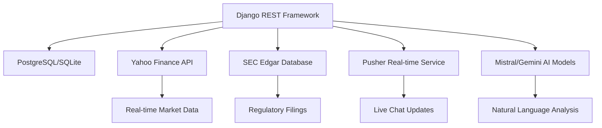
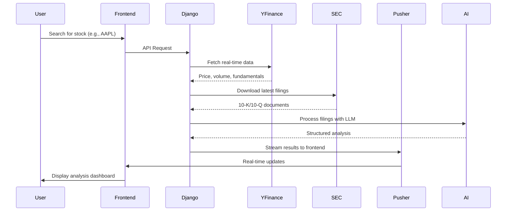
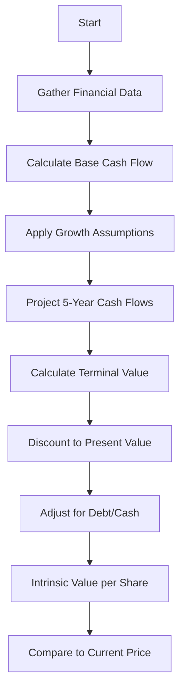
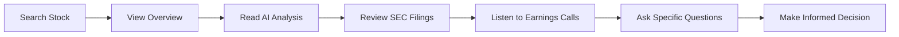

# Financial AI - Investment Risk Analysis Platform

**Empowering investors with data-driven insights to make informed decisions**

## ⚠️ Important Disclaimer

**This is NOT investment advice.** Financial AI provides analytical tools and data to help you understand company risks, financial health, and market positioning. All investment decisions should be based on your own research, risk tolerance, and financial situation. We strongly recommend consulting with a certified financial advisor before making any investment decisions.

---

## 🎯 Platform Overview

Financial AI is a comprehensive investment research platform that combines real-time market data with advanced AI analysis to help investors understand company fundamentals, identify risks, and evaluate potential opportunities.

### Key Features

- **Real-time Stock Search**: Find companies with Yahoo Finance integration
- **SEC Filings Analysis**: Automated processing of 10-K and 10-Q reports
- **AI-Powered Insights**: Natural language analysis of financial documents
- **DCF Valuation**: Discounted Cash Flow calculations with transparent assumptions
- **Earnings Call Analysis**: Transcript processing with risk highlighting
- **Real-time Chat Interface**: Ask questions about specific companies
- **Audio Clip Extraction**: Listen to key moments from earnings calls

## 🔧 Technology Stack

### Backend Architecture



### Data Flow Diagram



## 🚀 Getting Started

### Prerequisites

- Python 3.12+
- Node.js 18+
- PostgreSQL (recommended) or SQLite
- Pusher account (for real-time features)
- Mistral or Gemini API keys

### Installation

#### Backend Setup

```bash
cd backend
# Install dependencies
uv sync  # or pip install -r requirements.txt

# Set up environment variables
cp .env.example .env
# Edit .env with your API keys

# Run migrations
python manage.py migrate

# Start development server
python manage.py runserver
```

#### Frontend Setup

```bash
cd frontend
npm install
npm run dev
```

## 📊 Core Components

### 1. Data Sources Integration

#### Yahoo Finance Integration
- Real-time stock prices and fundamentals
- Company search and autocomplete
- Historical data for valuation models

#### SEC Edgar Integration
- Automated download of 10-K and 10-Q filings
- Parsing of complex financial documents
- Extraction of key financial metrics

### 2. AI Analysis Engine

```python
# Example DCF Analysis Flow
class DCFService:
    def calculate_dcf(ticker):
        # 1. Fetch financial data from Yahoo Finance
        stock = yf.Ticker(ticker)
        
        # 2. Calculate base cash flow
        base_fcf = max(fcf, net_income)
        
        # 3. Apply growth assumptions
        growth_rate = calculate_growth_rate()
        
        # 4. Project future cash flows
        projections = project_cash_flows(base_fcf, growth_rate)
        
        # 5. Calculate terminal value
        terminal_value = calculate_terminal_value()
        
        # 6. Determine intrinsic value
        return intrinsic_value_per_share
```

### 3. Real-time Communication

The platform uses Pusher for real-time updates:

```javascript
// Frontend subscription example
const pusher = new Pusher('YOUR_KEY', {
    cluster: 'YOUR_CLUSTER'
});

const channel = pusher.subscribe('chat_' + sessionId);
channel.bind('ai-chunk', function(data) {
    // Stream AI responses in real-time
    appendToChat(data.content);
});
```

## 🎓 Investment Analysis Methodology

### 1. Fundamental Analysis

- **Revenue Growth**: Year-over-year comparison
- **Profit Margins**: Net income vs revenue trends
- **Cash Flow Health**: Operating vs free cash flow
- **Debt Levels**: Debt-to-equity ratios

### 2. Risk Assessment

The AI specifically highlights:

- **Operational Risks**: Supply chain issues, production challenges
- **Financial Risks**: High debt levels, cash flow problems
- **Market Risks**: Competitive threats, industry disruption
- **Management Risks**: Evasive answers, unclear strategies

### 3. Valuation Approach




## 🔍 How to Use This Platform

### 1. Stock Research Workflow



### 2. Understanding the Analysis

**What the platform provides:**
- Objective data presentation
- Risk highlighting
- Valuation comparisons
- Historical context

**What the platform does NOT provide:**
- Buy/sell recommendations
- Price targets
- Timing advice
- Guarantees of any kind

## 🛡️ Risk Management Features

### 1. Earnings Call Analysis

The AI specifically flags:
- **Evasive Answers**: When management avoids direct questions
- **Pressing Questions**: Tough questions from analysts
- **Incomplete Responses**: Vague or non-committal answers
- **Strategic Shifts**: Major changes in direction

### 2. Financial Health Indicators

```python
# Key metrics monitored
def assess_financial_health(stock):
    health_score = 100
    
    # Debt check
    if debt_to_equity > 2.0:
        health_score -= 20
    
    # Cash flow check
    if operating_cash_flow < net_income:
        health_score -= 15
    
    # Profitability check
    if net_margin < 5%:
        health_score -= 25
    
    return health_score
```

## 📚 Educational Resources

### Understanding Key Concepts

**DCF (Discounted Cash Flow):**
- Method to estimate investment value based on future cash flows
- Considers time value of money
- Sensitive to growth assumptions

**SEC Filings:**
- 10-K: Annual comprehensive report
- 10-Q: Quarterly updates
- Contains audited financial statements

**Earnings Calls:**
- Quarterly management presentations
- Q&A with analysts
- Often contains forward-looking statements

## 🤝 Community Guidelines

1. **Do Your Own Research**: Always verify information
2. **Diversify**: Never put all funds in one investment
3. **Understand Your Risk Tolerance**: Invest accordingly
4. **Long-term Perspective**: Avoid short-term speculation
5. **Continuous Learning**: Markets are always evolving

## 🚨 Important Reminders

- Past performance ≠ future results
- All investments carry risk
- Market conditions can change rapidly
- Company fundamentals can deteriorate
- Always have an exit strategy

## 📞 Support

For technical issues with the platform:
- Open a GitHub issue
- Check the documentation
- Review the setup instructions

For investment advice:
- Consult a certified financial advisor
- Consider your personal financial situation
- Evaluate your risk tolerance
- Never invest money you can't afford to lose

---

**Financial AI - Knowledge is your best investment** 📊💡
